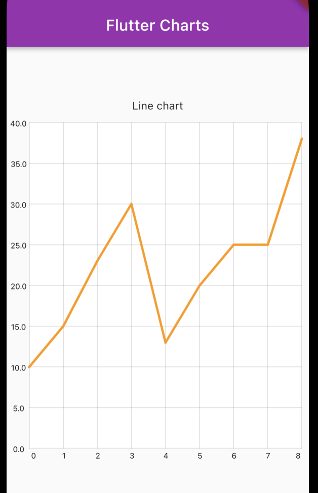
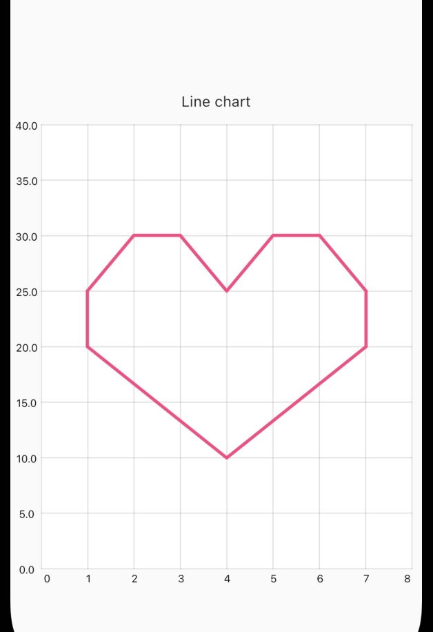

# About plugin
The package helps the developer to draw different charts on the page screen. If
the developer wants to show any data on the screen as a chart, he can use this package.

## Examples of charts
COLUMN or LINE charts builder.






# Features

- **StrokeCap?** strokeCap - corner radius of the chart.
- **double?** strokeWidth - Width of the chart.
- **Color?** color - Color of the chart.
- **String?** label - You can add a label to the chart.

# Getting started

## pub dependency

dependencies:
ezio_flutter_charts_package: ^0.01

## importing

importing:
```import 'package:ezio_flutter_charts_package/ezio_flutter_charts_package.dart';```

# Usage

example: https://github.com/donrast41/ezio_flutter_charts_package/tree/develop/example

```dart
SizedBox(
    height: 600,
    child: ColumnChart(
    color: Colors.purple,
    strokeWidth: 4,
    strokeCap: StrokeCap.butt,
    label: 'Column chart',
    chartPoints: widget.chartPoints,
    axisPoints: widget.axesPoints,
    context: context,
  ),
),
```

# Additional information

If you want to see source code, go to package git -> https://github.com/donrast41/ezio_flutter_charts_package
